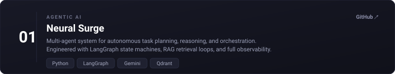
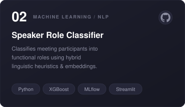
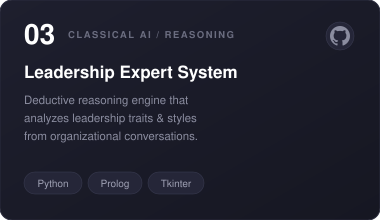
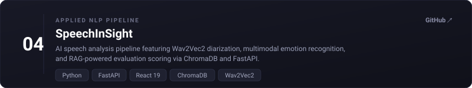
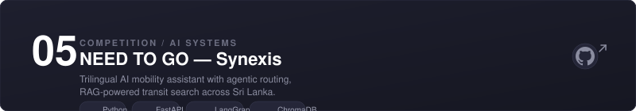
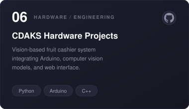

# Denuwan Wijesinghe

Artificial Intelligence undergraduate at the University of Moratuwa and AI Engineer at WIWIS.AI.

Interested in building intelligent systems that combine reasoning, learning, and interaction. My current work explores agentic AI, language technologies, multimodal intelligence, and machine learning for real-world applications, with a particular interest in low-resource languages.

## Selected Work

* **HomeOS** *(AgentriX 2026 Finalist)* — Multi-agent system for autonomous task planning and orchestration.
* **Smart Transit Companion** *(SLAIC 2025 Finalist)* — Multilingual transportation assistant built around retrieval and reasoning.
* **WEISION** *(Presented at SLAAI 2025 AI Project of the Year)* — Edge AI system for vision-based produce identification and automated billing.
* **Speaker Role Classification** *(Industry collaboration project with Embla Software Innovation (Pvt) Ltd.)* — Machine learning approach for understanding organizational roles from meeting conversations.

> *"Build carefully. Measure honestly. Publish what matters."*

📍 Sri Lanka
## Featured Projects

<!-- Featured Project Cards -->

